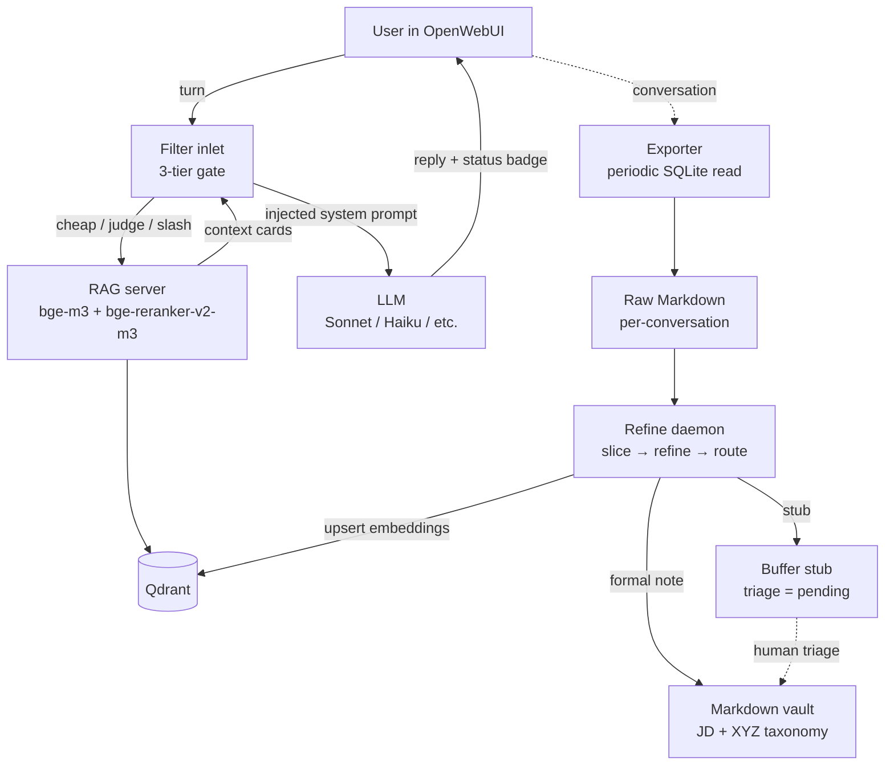

# throughline

> The thread that turns every LLM conversation into searchable, self-growing personal knowledge.

<!-- badges-placeholder: build / license / python-version -->

**Status:** 🚧 Alpha — the reference implementation runs 24/7 for the author, but docs and examples for external users are being cleaned up. Expect rough edges until v0.1.0 tag.

---

## ✨ What it does

```
You chat in OpenWebUI
    → conversations auto-export to Markdown
    → LLM slices / refines / de-identifies each turn
    → structured knowledge cards land in your Obsidian vault
    → local embedding + reranking builds a RAG over those cards
    → next time you ask, past knowledge is auto-injected
    → new conversation produces new cards → loop
```

Three distinctive pieces you won't find glued together elsewhere:

1. **Haiku RecallJudge** — a single small-LLM call replaces mode/aggregate/topic-shift/query-rewrite detection. Badge shows the judge's verdict inline.
2. **Concept anchors** — self-growing whitelist of entities in your vault that short-query RAG gating uses to avoid embedding drift.
3. **Personal Context cards** — 4-layer stack (Filter valve → reranker boost → `<topic>__profile.md` auto-build → optional FastAPI agent) that injects your real profile into answers without contaminating the public RAG index.

---

## 🚀 Quickstart

Full install guide is [`docs/DEPLOYMENT.md`](docs/DEPLOYMENT.md). Five steps, roughly:

1. **Clone and configure** — `git clone`, `cp config/.env.example .env`, fill in `OPENROUTER_API_KEY`, `VAULT_PATH`, and a few paths.
2. **Start Qdrant** — one `docker run` line; the collection is created on first ingest.
3. **Launch the RAG server** — `python rag_server/rag_server.py` (foreground) or install the `launchd` / `systemd` template under `config/`.
4. **Launch the refine daemon** — `python daemon/refine_daemon.py` (foreground) or install the service template. On first start the daemon catches up on any raw conversations already on disk.
5. **Install the Filter** — paste `filter/openwebui_filter.py` into OpenWebUI Admin → Functions, set `OPENROUTER_API_KEY` and `RAG_SERVER_URL` valves, enable for your models.

Smoke test: ask something in OpenWebUI that overlaps your existing notes. You should see a status line above the reply (`⚡ anchor pass` or `auto recall: mode=general · conf=0.82 · N cards`), an injected context in the answer, and a `🛰️ daemon · …` outlet badge when the daemon is running.

---

## 🏗️ Architecture



Two independent pipelines meet at Qdrant and the Markdown vault on disk. The Filter pipeline runs per-turn, in-band with the conversation, and never writes to the vault. The daemon pipeline runs out-of-band, produces knowledge cards from completed conversations, and never reads live chat sessions. Filter bugs cannot corrupt the vault; daemon bugs cannot pollute a live reply.

See [`docs/ARCHITECTURE.md`](docs/ARCHITECTURE.md) for the full story (three-tier recall gate, five integrity layers, Pack system, Echo Guard, Master-Event duality, 4-layer personal context, concept anchors, taxonomy, forward-slash normalisation, orthogonal mode triggering).

---

## 📁 Repository layout

```
throughline/
  filter/           OpenWebUI Filter Function (single-file paste into Admin → Functions)
  daemon/           Refine daemon (watches raw conversations, writes cards)
  rag_server/       FastAPI service: embedding, reranking, RAG endpoint, refine-status
  packs/            Pluggable domain packs (slicer/refiner/routing overrides; PTE example shipped)
  scripts/          One-off tooling: vault ingest, concept-anchor cold start, context sync
  prompts/en/       Verbatim mirror of the runtime prompt strings (review / translation surface)
  config/           .env.example, taxonomy template, forbidden_prefixes, launchd / systemd templates
  docs/             Architecture, deployment, design decisions, badge reference, strip log
  examples/         Small walkthrough fixtures
```

Each top-level directory has its own `README.md` for local detail.

---

## 💡 Why this exists

Most personal-knowledge tools either:
- **Record** but don't **synthesize** (raw transcripts pile up)
- **Synthesize** but lose **personal context** (generic answers about your own meds / projects / history)
- **Inject personal context** but leak it into the **public index** (your RAG now has your address in it)

This project separates *mechanism* (system provides) from *content* (you provide) at every layer, so you can safely share the engine without sharing yourself.

---

## 🔗 Links

- [Architecture](docs/ARCHITECTURE.md) — how the pieces fit
- [Deployment](docs/DEPLOYMENT.md) — end-to-end install
- [Design decisions](docs/DESIGN_DECISIONS.md) — why each call was made
- [Filter badge reference](docs/FILTER_BADGE_REFERENCE.md) — complete UI legend
- [Chinese-removal log](docs/CHINESE_STRIP_LOG.md) — what was stripped from the upstream private codebase and why (community re-i18n starts here)
- [Phase 6 regression checklist](docs/PHASE_6_CHECKLIST.md) — English-only test gates for pre-v0.1.0

---

## 🧪 Phase 6 regression (pre-v0.1.0)

The English rewrite has never been A/B'd against the original Chinese build. Phase 6 is the regression pass that validates the rewrite before tagging `v0.1.0`. Run `pytest fixtures/phase6/` for the offline gates or the individual `python fixtures/phase6/run_h*.py` scripts for live LLM gates.

| Gate | Scope | Status |
|---|---|---|
| **H1** RecallJudge classification drift | 48 EN turns × real Haiku 4.5 | **45/48 PASS (93.8%)** — 3 brainstorm-mode drift accepted as known EN-tone limitation |
| **H2** Cheap-gate short-turn routing | 20 EN turns offline | **10/20 MATCH + 10 documented gaps** — first-turn bare pronouns fall through to judge (accepted ~$0.003/turn cost) |
| **H3 code** Card injection wrapper + truncation | 9 offline assertions | **9/9 PASS** — card bodies always wrapped as DATA not INSTRUCTIONS |
| **H3 Haiku** Injection/PII/roleplay resistance | 31 EN turns × real Haiku 4.5 | **31/31 PASS (100%)** — zero compliance, zero leakage across 7 fingerprints |
| **H4** 4 refiner prompts (refine + route_domain) | 8 EN fixtures × real Sonnet 4.6 | **15/16 PASS (93.8%)** — 1 WARN on universal-vs-personal tension, zero structural failures |

Total phase-6 regression cost against live APIs: **~$0.44**. See [`fixtures/phase6/SESSION_STATE.md`](fixtures/phase6/SESSION_STATE.md) for the full run log and `H*_ANALYSIS.md` per-gate deep dives.

---

## 🤝 Contributing

PRs welcome once we hit `v0.1.0`. For now:
- Issues for bugs / design questions — yes
- Feature PRs — wait for v0.1.0 tag
- Docs / typo PRs — always yes

See [`CONTRIBUTING.md`](CONTRIBUTING.md).

---

## 📜 License

[MIT](LICENSE) — do what you want, no warranty.

---

## 🙏 Acknowledgments

Built on:
- [OpenWebUI](https://github.com/open-webui/open-webui) — the chat frontend
- [Qdrant](https://github.com/qdrant/qdrant) — vector DB
- [BAAI/bge-m3](https://huggingface.co/BAAI/bge-m3) + [bge-reranker-v2-m3](https://huggingface.co/BAAI/bge-reranker-v2-m3) — embeddings + reranking
- [OpenRouter](https://openrouter.ai) — model routing (Claude / Gemini / etc.)
