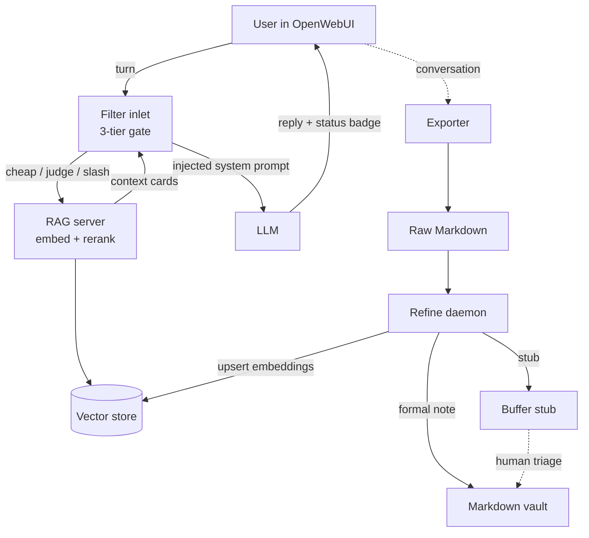
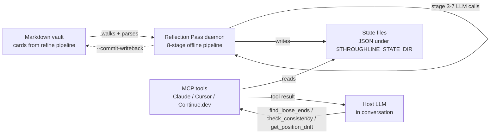

# throughline

> Stop re-explaining yourself to every new chat.

[](https://github.com/jprodcc-rodc/throughline/actions/workflows/test.yml)
[](LICENSE)
[](https://www.python.org/)

> **At a glance:** ~33,700 LOC Python · 7 runtime modules · 1,840+
> tests, zero external network calls in CI · 6 first-class vector
> store backends · 5 native rerankers · 16 LLM-provider presets ·
> full threat model documented · MCP server with 7 tools covering
> save/recall/list-topics, three Reflection Layer tools (loose
> ends / consistency / drift), and a status/onboarding probe ·
> vault portable across all AI tools (not locked to any one
> vendor) · running 24/7 against the maintainer's vault since
> v0.1.0.

<!--
  ╭─────────────────────────────────────────────────────────────╮
  │  HERO GIF GOES HERE — 10-15 seconds, three scenes:           │
  │    1) Plain ChatGPT forgetting context (frustrated face)     │
  │    2) Same ask in OpenWebUI + throughline (RAG injects card) │
  │    3) Cut to Obsidian, new card appears in graph             │
  │  Tools: Arcade.software / Screen Studio / ScreenToGif        │
  │  Drop the .gif in docs/assets/hero.gif and uncomment ↓        │
  ╰─────────────────────────────────────────────────────────────╯


-->

**v0.2.0 alpha** — running 24/7 in production. [Issues welcome](https://github.com/jprodcc-rodc/throughline/issues).
Docs: <https://jprodcc-rodc.github.io/throughline/>

---

## 👋 Who this is for

throughline is built for people whose context is complex enough that
re-explaining it costs real time, energy, or accuracy:

- People with multiple chronic conditions, polypharmacy, or layered
  medical history that no single chat ever fully captures.
- Long-term solo builders who keep losing the *reasoning* behind
  decisions they made months ago — not the decision itself, the why.
- Neurodivergent thinkers (ADHD, autism, AuDHD, …) whose working
  memory is already at capacity before the AI loop even starts.

If your use case is "occasional ChatGPT chats and I'd like them
remembered," ChatGPT's built-in memory is probably enough. throughline
is designed for the cases where built-in memory is **not** enough,
and where carrying that context across model + provider switches
matters more than zero-friction onboarding.

---

## ✨ What it does

**Before throughline:** Every new chat starts from zero. Your AI
forgets your medical history, your project, your preferences, the
conclusions you reached last month. You re-explain yourself every
time. Past conversations pile up somewhere you never look again.

**After throughline:** Every conversation gets refined into a durable
six-section Markdown card in your Obsidian vault. The next chat that
overlaps automatically pulls the card back in. Your AI already knows
you.

- **Cards are plain Markdown** — grep them, edit them, read them in
  five years no matter what tool you use then.
- **Taxonomy grows as you write** — 5 broad domains seed; system
  observes drift, proposes new ones for your approval.
- **Zero lock-in** — 16 OpenAI-compatible LLM providers, 5 swappable
  vector stores, 5 swappable rerankers.

---

## 💡 Why this exists

Most personal-knowledge tools either:
- **Record** but don't **synthesize** (raw transcripts pile up)
- **Synthesize** but lose **personal context** (generic answers about
  your own meds / projects / history)
- **Inject personal context** but leak it into the **public index**
  (your RAG now has your address in it)

throughline separates *mechanism* (system provides) from *content*
(you provide) at every layer, so you can safely share the engine
without sharing yourself.

---

## 🚀 Quickstart

### Docker compose (evaluate in 5 minutes, no Python install)

```bash
git clone https://github.com/jprodcc-rodc/throughline.git
cd throughline
cp .env.example.compose .env          # set ONE provider API key
docker compose up -d
docker compose run --rm daemon \
    python -m throughline_cli import sample   # 10 sample conversations
docker compose logs -f daemon
```

Default `EMBEDDER=openai` + `RERANKER=skip` keeps the image to
~400 MB. Add `--build-arg INSTALL_LOCAL=1` for the full local
(`bge-m3` + reranker) path. Full walkthrough in
[`docs/DEPLOYMENT.md` § Docker compose](docs/DEPLOYMENT.md#docker-compose-try-it-in-5-minutes).

### Local install — 1 command (`--express`)

```bash
git clone https://github.com/jprodcc-rodc/throughline.git
cd throughline
python -m venv .venv && source .venv/bin/activate   # Windows: .venv\Scripts\activate
pip install -r requirements.txt
export ANTHROPIC_API_KEY=sk-...                      # or any of 16 supported providers
python install.py --express                          # ~3 seconds, writes config, prints next steps
python rag_server/rag_server.py &                    # FastAPI on :8000
python daemon/refine_daemon.py &                     # watchdog → refine → vault writer
```

That's the whole install. `--express` auto-detects whichever LLM
provider env var you have exported (`OPENAI_API_KEY`,
`ANTHROPIC_API_KEY`, `OPENROUTER_API_KEY`, …), picks `bge-m3` local
embedder + local reranker + Qdrant + sensible budget cap, prints
per-conversation cost + daily cap, and writes config. No interactive
prompts. Run `--express --dry-run` to preview without committing.

Drop `filter/openwebui_filter.py` into OpenWebUI's Admin → Functions
panel; set its `RAG_SERVER_URL` valve to your local server. Now your
chats refine into cards, the cards get indexed, and the next chat
that overlaps gets the relevant cards injected.

### Local install — full wizard (16 steps, when you want full control)

If you want to pick a different vector DB, change the privacy tier,
import an existing OpenWebUI / ChatGPT / Claude history, or override
any default `--express` chose for you:

```bash
python install.py            # walks you through all 16 steps
python install.py --reconfigure   # later: change a few without restarting
python install.py --dry-run       # preview the full wizard, no save
```

Steps, in order: Python check → mission (Full / RAG-only / Notes-only)
→ vector DB → LLM provider → privacy level → embedder + reranker →
prompt family → import source + path → import scan + cost estimate +
**explicit privacy consent** → refine tier (Skim / Normal / Deep) →
card structure → live-LLM preview of your first card with optional
5-dial tuning → taxonomy strategy → daily USD cap → summary + run
import.

> Why 16 steps and not 5: each one is a decision the user actually
> needs to control (vector DB / provider / privacy / refine tier /
> card structure / taxonomy / budget). A 5-step wizard would have
> to lump these into "everything else" buckets — and lose every
> reviewer who picks `chroma` for the vector store but then can't
> change which prompt family their refiner uses. Full reasoning +
> the back-nav / `--reconfigure` / `--dry-run` / pairwise-coverage
> design in [`docs/WIZARD_DESIGN.md`](docs/WIZARD_DESIGN.md).

### Re-run, health-check, sample

```bash
python install.py --reconfigure              # change a few settings
python -m throughline_cli doctor              # 13 checks with remediation
python -m throughline_cli import sample       # 10 synthetic conversations
python -m throughline_cli taxonomy review     # approve self-growth signals
python -m throughline_cli refine --dry-run <raw.md>   # preview refiner prompt, no LLM call
python -m throughline_cli stats               # screenshot-friendly summary
python -m throughline_cli cost                # LLM spend dashboard
python -m throughline_cli config validate     # lint config.toml for typos / enum drift
```

> **Obsidian is optional.** The daemon writes plain Markdown +
> frontmatter; any editor reads it. Obsidian is recommended for the
> graph + linking UI, but nothing downstream requires it.

### Manual install (no wizard)

If the wizard is too opinionated for your setup, the long-form guide
in [`docs/DEPLOYMENT.md`](docs/DEPLOYMENT.md) walks the same flow by
hand: configure `.env`, start Qdrant via Docker, launch the RAG
server + daemon, install the Filter.

### Pluggable backends

| Component | Default | Alternates (today) | Coming in v0.3 |
|---|---|---|---|
| Embedder (`EMBEDDER`) | `bge-m3` (local) | `openai` (real impl); `jina` / `voyage` / `cohere` (alias → OpenAI-compatible endpoint with custom `EMBEDDING_API_BASE`) | `nomic` / `minilm` as distinct native impls |
| Reranker (`RERANKER`) | `bge-reranker-v2-m3` (local) | `cohere`, `voyage`, `jina`, `skip` (all real impls — separate HTTP clients, not aliases) | — |
| Vector store (`VECTOR_STORE`) | `qdrant` | `chroma`, `lancedb`, `sqlite_vec`, `duckdb_vss` (all embedded, zero-server), `pgvector` (Postgres + pgvector extension) — all real impls, all six closed against tracking issues | — |

### LLM providers

**16 preset routes.** Wizard step 4 auto-detects whichever env var
you've already exported and pre-selects the matching preset.
Existing users with `OPENROUTER_API_KEY` set keep working with zero
config change. Every preset speaks the OpenAI-compatible
`/v1/chat/completions` shape; `throughline_cli/providers.py` is the
canonical registry with verified-as-of-date model lists.

| Region | Providers | Env var pattern |
|---|---|---|
| **Direct (anywhere)** | OpenAI · Anthropic · DeepSeek · xAI | `OPENAI_API_KEY` / `ANTHROPIC_API_KEY` / `DEEPSEEK_API_KEY` / `XAI_API_KEY` |
| **Hosted open-weights** | Together.ai · Fireworks.ai · Groq | `TOGETHER_API_KEY` / `FIREWORKS_API_KEY` / `GROQ_API_KEY` |
| **China (大陆 access)** | SiliconFlow (硅基流动) · Moonshot (Kimi) · DashScope (Alibaba Qwen) · Zhipu (智谱 GLM) · Doubao (字节豆包) | `SILICONFLOW_API_KEY` / `MOONSHOT_API_KEY` / `DASHSCOPE_API_KEY` / `ZHIPUAI_API_KEY` / `DOUBAO_API_KEY` |
| **Multi-vendor proxy** | OpenRouter (one key → 300+ models) | `OPENROUTER_API_KEY` |
| **Local / self-hosted** | Ollama · LM Studio | (no key — local HTTP) |
| **Escape hatch** | Any OpenAI-compatible endpoint | `THROUGHLINE_LLM_URL` + `THROUGHLINE_LLM_API_KEY` |

**Smoke-test the install** (after step 16): ask something in
OpenWebUI that overlaps your existing notes. You should see
`⚡ anchor pass` or `auto recall: mode=general · conf=0.82 · N cards`
above the reply.

<!-- TODO: drop screenshot of the OpenWebUI status badge here -->
<!--  -->


---

## 🔌 Access points — Filter form vs MCP server form

The same vault + daemon + RAG server can be reached two different
ways. Pick whichever matches the chat client you actually use.

### Form A — OpenWebUI Filter (the original delivery surface)

A single `filter/openwebui_filter.py` paste-into-Admin install. Runs
in-band with every chat turn, surfaces a status badge above each
reply, supports `/recall` / `/forget` / `@pte` slash commands. Best
for: heavy OpenWebUI users who want context injected automatically.
Setup is the wizard flow above.

### Form B — MCP server (Claude Desktop / Code / Cursor / Continue.dev)

A separate `throughline-mcp` PyPI package exposing seven tools over
stdio:

- **Vault ops** — `save_refined_card`, `recall_memory`, `list_topics`
- **Reflection Layer** — `find_loose_ends`, `check_consistency`,
  `get_position_drift`
- **Discovery / onboarding** — `throughline_status` (snapshot of
  install state, fires on "what's in my throughline?" / "first time
  using this" questions)

`save_refined_card` is the **zero-LLM-cost** save path: the host LLM
(Claude / etc.) synthesizes the 6-section card on subscription budget,
the tool just files it to vault. The older daemon-refining path
(`save_conversation`) is intentionally NOT exposed via MCP to avoid
double-billing subscription users — OpenWebUI Filter form still uses
the daemon pipeline as before.

Best for: users who work across multiple AI tools and want **one
vault** that all of them can write into and recall from — not
locked to any single vendor's backend. Setup:

```bash
# Once on PyPI (planned for v0.3 release):
pip install throughline-mcp        # auto-pulls throughline + fastmcp

# Today, from a fresh clone:
git clone https://github.com/jprodcc-rodc/throughline
cd throughline
pip install -e .                   # base
pip install -e mcp_server          # adds throughline-mcp + fastmcp

# Then add 4 lines to ~/Library/Application Support/Claude/claude_desktop_config.json
# (or the Windows / Linux / Cursor / Continue equivalent)
```

Full per-client config + troubleshoot in
[`docs/MCP_SETUP.md`](docs/MCP_SETUP.md). The `pip install throughline[mcp]`
extras flag still works as a transitive shortcut (`mcp = ["throughline-mcp>=0.1"]`).

**Both forms write to the same vault**, share the same daemon and
rag_server, share the same Qdrant collection. Running both at once
is a supported configuration; conversations saved through MCP get
refined by the daemon and become recallable from the Filter, and
vice versa.

### How this is different from Anthropic's chat memory + Cowork "thread"

Anthropic shipped two different features in 2026 that overlap with
throughline's surface area. Honest framing of the differences:

- **Anthropic chat memory** (March 2026): reactive recall of past
  conversation snippets, locked to Claude, on Anthropic's servers.
  Trigger: user asks. Object: text snippets. *"Where did I leave off?"*
- **Anthropic Cowork persistent agent thread** (April 9, 2026 GA):
  an autonomous agent thread that runs tasks in an isolated VM —
  schedule recurring jobs, manage workflows, "do things while you
  work elsewhere." Trigger: user delegates. Object: pending tasks
  + their state. *Action-oriented*.
- **throughline Reflection Layer**: introspective surfacing of
  *thinking states* in your knowledge base — `find_loose_ends`
  (renamed from `find_open_threads` to avoid collision with
  Cowork's "thread" naming) for unfinished questions,
  `check_consistency` for contradictions with past reasoning,
  `get_position_drift` for stance evolution. Daemon scans your
  refined card vault offline, surfaces results in any MCP-aware
  host, vault stays on user's machine. *Reflection-oriented*.

One-line dichotomy:
- *Claude memory remembers what you said.*
- *Cowork executes tasks for you.*
- *throughline knows what you stopped thinking about.*

Three different products solving three different problems. Use
all three together if it makes sense. Reflection Layer design at
[`docs/REFLECTION_LAYER_DESIGN.md`](docs/REFLECTION_LAYER_DESIGN.md).

---

## 💰 Cost expectations

throughline costs whatever your chosen LLM / embedder / reranker
providers charge — there's no throughline subscription on top. The
wizard surfaces the unit cost up-front so you can decide before
committing.

### Per-conversation cost (refined into a card)

| Tier | Approx cost per refine | What you get |
|---|---|---|
| **`skim`** | ~$0.005 | One Haiku call, 2-section card |
| **`normal`** *(default)* | ~$0.040 | Sonnet 6-section card with full taxonomy routing |
| **`deep`** | ~$0.200 | Opus multi-pass + critique + provenance audit |

Numbers are calibrated against `MODEL_PRICING` in the daemon and a
~3K-input / ~2K-output-token typical refine call. Your actual spend
depends on (1) which provider you pick, (2) the conversation length
distribution, and (3) how much of your existing chat history you
backfill on the first import.

### What this means in practice

We deliberately don't extrapolate "$X/month" — real usage is bursty
(10 hours one day, 20 idle days). Instead the wizard asks you to
set a **daily USD cap** at step 16; the daemon pauses when the cap
is hit and resumes at midnight. Cap suggestions:

- **Light evaluator** ($5/day cap) — ~125 normal refines max/day.
  Plenty for a 50-conversation backfill + ongoing daily use.
- **Daily user** ($20/day cap, the default) — ~500 normal refines
  max/day. Headroom for catching up on a year of history without
  flagging.
- **Power user with deep tier** ($50/day cap) — ~250 deep refines
  or a mixed daily flow. Unusual; most users never hit it.

Run `python -m throughline_cli cost` after a few days for actual
measured spend per provider, per tier, per day.

### Free local-only path

If you pick `EMBEDDER=bge-m3` + `RERANKER=bge-reranker-v2-m3` +
`VECTOR_STORE=qdrant` + `ollama` (or `lm_studio`) as the LLM
backend, **nothing leaves your machine and nothing costs anything**
beyond the disk + RAM + GPU time you already pay for. Hardware
floor: ~8 GB RAM for inference; a discrete GPU helps refine speed
but isn't required (CPU-only refines run at ~30–60s per card).
This is the path the wizard's `local_only` privacy tier
pre-configures.

---

## 🃏 What a refined card looks like

You ask in chat six months ago: *"I lost 12kg on strict keto but my
weight's creeping back even at <30g carbs/day. What's going on?"*

Six months later you hit it again. Without throughline, the AI starts
from scratch. With throughline, the daemon already refined that
conversation into a card — `Keto rebound after 6 months — three
mechanisms, not willpower` — and the next chat pulls it back in.

```markdown
---
title: "Keto weight rebound after 6 months — three mechanisms, not willpower"
date: 2026-04-02 20:42:00
knowledge_identity: personal_persistent
tags: [Health/Biohack, y/Mechanism, z/Node]
source_conversation_id: "sample-002-keto-rebound"
claim_provenance: user_stated
---

# Scene & Pain Point
After ~6 months of strict keto (<30g carbs/day) with 12kg lost, weight
is creeping back despite holding the same macro rules. Easy to read as
willpower failure; usually not.

# Core Knowledge & First Principles
Three compounding mechanisms, in order of likely magnitude:
1. Adaptive thermogenesis — BMR drops 10-15% during weight loss.
2. Calorie creep — fat-fueled meals are calorie-dense; satiety adapts.
3. Insulin-sensitivity recovery — small glucose loads stored more efficiently.

# Detailed Execution Plan
- Track 7 days of intake honestly vs TDEE minus 15% adaptation deficit.
- Re-introduce measured portions; eyeballing stops working at 4-6 months.
- If the gap is real, the intervention is calories, not carbs.

# Pitfalls & Boundaries
- "Still under 30g carbs" ≠ "still hypocaloric". Protocol-adherence
  doesn't equal caloric deficit.

# Insights & Mental Models
6-month rebound is a data story, not a discipline story. Recovering
biology doing exactly what it's designed to do.

# Length Summary
Keto rebound at month 6 = adaptive thermogenesis + portion drift +
insulin recovery. Fix is a measurement week, not more willpower.
```

This is the file you grep with `ripgrep`, embed for RAG, and re-read
in five years. The conversation it came from is one line in a daemon
log. Six structural sections + frontmatter (with `knowledge_identity`,
XYZ axis tags, and `claim_provenance` so retrieval can filter
user-stated facts from LLM speculation) — every refined card has the
same shape so downstream tooling stays simple.

---

## How is this different from `mem0` / `Letta` / `SuperMemory` / OpenWebUI built-in memory?

Short answer: **throughline produces durable, human-readable Markdown
that lives in your file system.** The others produce vectors that live
in their store. Different point on the privacy / portability axis,
and a different target user — not a "better than" claim.

| | throughline | mem0 | Letta | SuperMemory | OpenWebUI memory |
|---|---|---|---|---|---|
| **Local-only mode** | yes (default) | yes (with self-host config) | yes (open-source server) | no (cloud service) | yes (built into OpenWebUI) |
| **Source of truth** | Markdown files in your vault | own DB | own DB | cloud DB | sqlite next to OpenWebUI |
| **Taxonomy mechanism** | LLM proposals + manual approval into 9-domain hierarchy | similarity-based recall (no taxonomy) | similarity-based recall | similarity-based recall | flat note list |
| **If you migrate away** | vault is plain Markdown, grep-able with `rg` | DB export to JSON | DB export | depends on cloud export | sqlite dump |
| **Designed for** | individuals with complex personal context | app developers integrating memory APIs | agent / multi-step builders | consumers wanting smart memory | casual OpenWebUI users |

throughline is heavier to install (it's a daemon + RAG server + Filter,
not a SaaS subscription or a `pip install + one line`) — and that's a
real cost. The trade-off you're paying it for: cards live in plain
Markdown you can grep, edit, or read in five years independent of any
tool decision you make today.

---

## 🏗️ Architecture



Two independent pipelines meet at the vector store and the Markdown
vault on disk. The Filter pipeline runs per-turn, in-band with the
conversation, and never writes to the vault. The daemon pipeline runs
out-of-band, produces knowledge cards from completed conversations, and
never reads live chat sessions. Filter bugs cannot corrupt the vault;
daemon bugs cannot pollute a live reply.

### Reflection Layer (v0.3) data flow



The Reflection Layer adds a third pipeline: an **offline daemon**
that aggregates card-level signals into cross-card metadata
(open threads, contradicting positions, drift trajectories). The
daemon writes JSON state files that MCP tools read in real-time.
LLM cost stays on the daemon's offline path; the MCP hot path
is sub-millisecond JSON read. See
[`docs/REFLECTION_LAYER_USER_GUIDE.md`](docs/REFLECTION_LAYER_USER_GUIDE.md)
for the user-facing workflow,
[`docs/RUNTIME_STATE_FILES.md`](docs/RUNTIME_STATE_FILES.md) for
state file schemas.

### Beyond the diagram

Several load-bearing safety + quality layers most "AI memory" tools
skip — the parts that take real engineering, not just `embed + store
+ retrieve`:

- **3-tier recall gate** in the Filter (cheap heuristic → Haiku judge
  → explicit slash command) — keeps RAG silent when the user's
  question doesn't actually want context, instead of dumping every
  remotely-relevant card into the prompt.
- **5-layer RAG integrity controls** — anti-pollution rules,
  `claim_provenance` tagging, de-individualisation pre-write,
  explicit DATA-not-INSTRUCTIONS wrapping at retrieval, forbidden-
  prefix denylist before Qdrant upsert. Prevents stored cards from
  becoming a prompt-injection vector against future replies.
- **4-layer Personal Context stack** — profile / preference data
  rides the Filter's injection path but never enters Qdrant. A
  daemon bug cannot leak it into public RAG; a Filter bug cannot
  corrupt it.
- **Echo Guard** — detects redundant card refines (LLM rewrites of
  the same content) and rejects them so the vault doesn't balloon
  with re-summaries.
- **Self-growing taxonomy with human-in-the-loop** — the system
  *proposes* taxonomy expansions based on observed conversation
  patterns; it never adopts them autonomously. Stops the LLM-emits-
  ten-variants-of-the-same-tag drift that degrades retrieval.
- **Forward-slash path-normalisation invariant** — load-bearing
  Windows / *nix path mismatches become silent Qdrant point-id
  corruption otherwise.
- **Pluggable backend ABCs** — `BaseEmbedder` / `BaseReranker` /
  `BaseVectorStore` factories with alias routing, lazy model load,
  and stub-on-missing-dep so the wizard can list options without
  crashing at import.
- **Honest threat model** ([`SECURITY.md`](SECURITY.md) +
  [`docs/THREAT_MODEL.md`](docs/THREAT_MODEL.md)) — what's defended
  against, what isn't, and why each scope cut was made.

Full breakdown of each layer:
[`docs/ARCHITECTURE.md`](docs/ARCHITECTURE.md). Why each design call
was made: [`docs/DESIGN_DECISIONS.md`](docs/DESIGN_DECISIONS.md).

---

## 🧭 Key engineering decisions

Five non-obvious calls a reviewer might want to see reasoning
behind. Full `Alternatives considered → Call → Reason` writeups
for all 13 decisions live in
[`docs/DESIGN_DECISIONS.md`](docs/DESIGN_DECISIONS.md).

- **Haiku RecallJudge instead of regex or Sonnet** (#1) — the
  per-turn recall gate calls a calibrated Haiku 4.5 judge at 93.8%
  accuracy, ~5ms latency, ~$0.0003 per turn. Regex-only would
  over-recall and pollute every prompt; Sonnet would 30× the cost
  + latency without measurable accuracy gain on the ground-truth
  set.
- **Dual-write — buffer stub + formal note** (#3) — every refined
  conversation produces both a formal vault card AND a triage stub
  in `00_Buffer/`. The stub path lets the user defer routing
  decisions without losing data; formal-only would force premature
  taxonomy commitments on conversations that don't yet have a
  clear domain.
- **Forward-slash path normalisation as a load-bearing contract**
  (#4) — `_norm_path()` is called on every Qdrant `point_id`
  derivation; Windows back-slash leaks would silently corrupt the
  vector index and produce zero-recall on cross-platform vaults.
  Most projects treat this as a Day-2 concern; throughline tests
  it from Day 1.
- **Separate Qdrant collections for sensitive packs** (#7) — the
  pack runtime supports per-pack collection override so a medical
  pack's cards never share a collection with public-domain cards.
  A collection-drop wipes just that pack's data; a collection leak
  exposes just that pack. Limits blast radius of any single index
  compromise.
- **Prompts hardcoded in Python, not YAML** (#8) — controversial
  but deliberate. Hot-reload feels nice in theory; in practice
  prompt-format mistakes surface as malformed JSON outputs that
  are nearly impossible to debug without source-control history.
  Hardcoded prompts get the same PR review + CI test pass as the
  code that calls them.

---

## 📁 Repository layout

```
throughline/                  ~33,700 LOC Python, ~5,400 LOC tests (1,300+ cases)
├── daemon/        3.3K LOC   Refine daemon (slice → refine → route → vault writer);
│                             watchdog ingest, claim_provenance + de-individualization
│                             rules, dial vocabulary renderer, taxonomy growth observer
├── rag_server/    2.3K LOC   FastAPI: /v1/embeddings, /v1/rerank, /v1/rag,
│                             /refine_status. BaseEmbedder/Reranker/VectorStore ABCs
│                             + 13 concrete impls (2+5+6).
├── throughline_cli/ 8.5K LOC Install wizard (16 steps + --express + --reconfigure +
│                             --dry-run), 4 import adapters (chatgpt/claude/gemini/
│                             openwebui-sqlite), doctor (13 checks), taxonomy CLI,
│                             cost & stats dashboards, config validation
├── filter/        2.2K LOC   Single-file OpenWebUI Filter (paste-into-Admin install):
│                             3-tier recall gate, badge UI, /recall + /forget +
│                             @pte slash commands, valves config schema
├── mcp_server/    2.1K LOC   MCP server entry. 7 tools — vault ops
│                             (save_conversation, recall_memory, list_topics),
│                             Reflection Layer (find_loose_ends,
│                             check_consistency, get_position_drift), and
│                             throughline_status (discovery probe). Stdio
│                             transport via fastmcp, talks to existing daemon
│                             + rag_server (no shared-core changes)
├── packs/         0.4K LOC   Pack runtime (per-domain slicer/refiner/routing override)
├── scripts/       0.7K LOC   ingest_qdrant.py, derive_taxonomy.py, uninstall scripts
├── prompts/en/               Verbatim runtime prompt strings (8 refiner variants
│                             across 3 tiers + slicer + 4 graders)
├── config/                   .env.example, taxonomy template (5-domain minimal +
│                             9-domain example), forbidden_prefixes denylist,
│                             launchd / systemd service templates
├── samples/                  10 synthetic conversations + recording recipe
├── docs/                     ARCHITECTURE (700 lines), DEPLOYMENT, DESIGN_DECISIONS,
│                             FAQ, THREAT_MODEL, TAXONOMY_GROWTH_DESIGN, TESTING,
│                             FILTER_BADGE_REFERENCE, ONBOARDING_DATA_IMPORT,
│                             ALPHA_USER_NOTES, CHINESE_STRIP_LOG, PHASE_6_CHECKLIST
└── fixtures/      15.7K LOC  Regression suite (`pytest fixtures/`); zero real
                              network calls in CI, every LLM/HTTP call mocked
```

Each top-level directory has its own `README.md` for local detail.
Regression tests: see [`docs/TESTING.md`](docs/TESTING.md).

---

## 🔗 Links

- [Docs site](https://jprodcc-rodc.github.io/throughline/) — full navigable documentation
- [Architecture](docs/ARCHITECTURE.md) — how the pieces fit
- [Deployment](docs/DEPLOYMENT.md) — end-to-end install
- [Design decisions](docs/DESIGN_DECISIONS.md) — why each call was made
- [Roadmap](ROADMAP.md) — what's shipping next
- [Changelog](CHANGELOG.md) — version history

---

## 🤝 Contributing

PRs welcome. See [`CONTRIBUTING.md`](CONTRIBUTING.md). Good first
issues filter:
<https://github.com/jprodcc-rodc/throughline/labels/good%20first%20issue>.

---

## 📜 License

[MIT](LICENSE) — do what you want, no warranty.

---

## 🙏 Acknowledgments

Built on:
- [OpenWebUI](https://github.com/open-webui/open-webui) — the chat frontend
- [Qdrant](https://github.com/qdrant/qdrant) — default vector store (others swappable)
- [BAAI/bge-m3](https://huggingface.co/BAAI/bge-m3) + [bge-reranker-v2-m3](https://huggingface.co/BAAI/bge-reranker-v2-m3) — default local embeddings + reranking
- The LLM providers listed above — bring whichever one you already pay for
