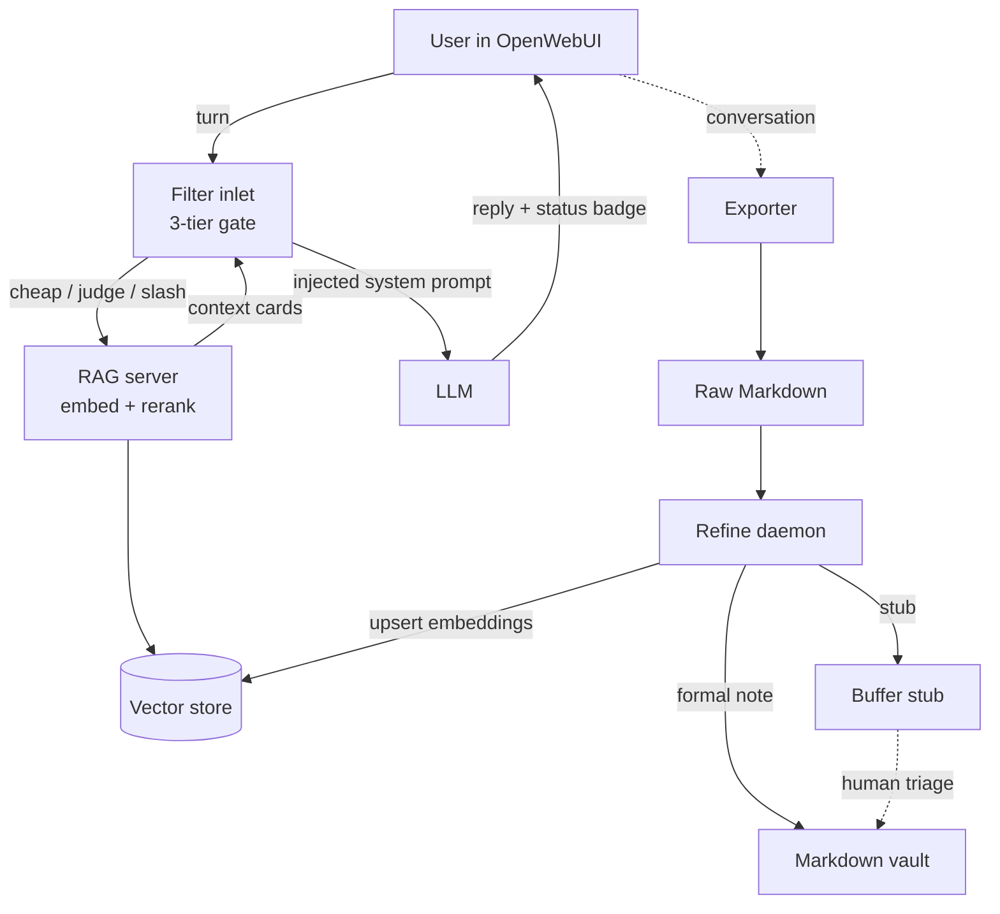

# throughline

> Stop re-explaining yourself to every new chat.

[](https://github.com/jprodcc-rodc/throughline/actions/workflows/test.yml)
[](LICENSE)
[](https://www.python.org/)

**v0.2.0 alpha.** Core pipeline is stable (running 24/7 in production).
Install wizard, import adapters, self-growing taxonomy, and 16 LLM-provider
presets all shipped. Expect rough edges around external deployment —
[issues welcome](https://github.com/jprodcc-rodc/throughline/issues).

Docs: <https://jprodcc-rodc.github.io/throughline/>

---

## ✨ What it does

**Before throughline**

Every new conversation starts from zero. Your AI forgets your medical
history, your project context, your preferences, the conclusions you
reached last month. You re-explain yourself, every time. Your past
conversations pile up somewhere you never look again.

**After throughline**

Every conversation you finish gets refined into a durable six-section
knowledge card and dropped into your Obsidian vault. The next time you
ask something that overlaps, a RAG layer pulls the relevant cards back
in automatically. Your AI already knows you.

- Cards are plain Markdown — grep them, edit them, read them in five
  years regardless of what tool you use then.
- The taxonomy grows as you write. Start with 5 broad domains; the
  system observes drift and proposes new ones for your approval.
- Zero lock-in: 16 OpenAI-compatible providers (Anthropic, OpenAI,
  DeepSeek, SiliconFlow, Ollama, …), swappable vector store (Qdrant,
  Chroma, +4 more), swappable embedder + reranker.

---

## 🚀 Quickstart

### Docker compose (evaluate in 5 minutes, no Python install)

```bash
git clone https://github.com/jprodcc-rodc/throughline.git
cd throughline
cp .env.example.compose .env          # set ONE provider API key
docker compose up -d
docker compose run --rm daemon \
    python -m throughline_cli import sample   # 10 sample conversations
docker compose logs -f daemon
```

Default `EMBEDDER=openai` + `RERANKER=skip` keeps the image to
~400 MB. Add `--build-arg INSTALL_LOCAL=1` for the full local
(`bge-m3` + reranker) path. Full walkthrough in
[`docs/DEPLOYMENT.md` § Docker compose](docs/DEPLOYMENT.md#docker-compose-try-it-in-5-minutes).

### Install wizard (16 steps, all-Enter defaults)

```bash
git clone https://github.com/jprodcc-rodc/throughline.git
cd throughline
python -m venv .venv && source .venv/bin/activate   # Windows: .venv\Scripts\activate
pip install -r requirements.txt
python install.py                                    # ← the 16-step wizard
```

What the wizard covers, in order: Python check → mission (Full /
RAG-only / Notes-only) → vector DB → LLM provider → privacy level →
embedder + reranker → prompt family → import source + path → import
scan + cost estimate + **explicit privacy consent** → refine tier
(Skim / Normal / Deep) → card structure → live-LLM preview of your
first card with optional 5-dial tuning → taxonomy strategy → daily
USD cap → summary + run import.

After the wizard:

```bash
python rag_server/rag_server.py        # FastAPI on :8000 — embed + rerank + retrieval
python daemon/refine_daemon.py         # watchdog → refine → vault writer
```

Drop `filter/openwebui_filter.py` into OpenWebUI's Admin → Functions
panel; set its `RAG_SERVER_URL` valve to your local server. Now your
chats refine into cards, the cards get indexed, and the next chat
that overlaps gets the relevant cards injected.

### Re-run, health-check, sample

```bash
python install.py --reconfigure              # change a few settings
python -m throughline_cli doctor              # 13 checks with remediation
python -m throughline_cli import sample       # 10 synthetic conversations
python -m throughline_cli taxonomy review     # approve self-growth signals
python -m throughline_cli refine --dry-run <raw.md>   # preview refiner prompt, no LLM call
python -m throughline_cli stats               # screenshot-friendly summary
python -m throughline_cli cost                # LLM spend dashboard
python -m throughline_cli config validate     # lint config.toml for typos / enum drift
```

> **Obsidian is optional.** The daemon writes plain Markdown +
> frontmatter; any editor reads it. Obsidian is recommended for the
> graph + linking UI, but nothing downstream requires it.

### Manual install (no wizard)

If the wizard is too opinionated for your setup, the long-form guide
in [`docs/DEPLOYMENT.md`](docs/DEPLOYMENT.md) walks the same flow by
hand: configure `.env`, start Qdrant via Docker, launch the RAG
server + daemon, install the Filter.

### Pluggable backends

| Component | Default | Alternates (today) | Coming in v0.3 |
|---|---|---|---|
| Embedder (`EMBEDDER`) | `bge-m3` (local) | `openai` | `nomic` / `minilm` natively |
| Reranker (`RERANKER`) | `bge-reranker-v2-m3` (local) | `cohere`, `voyage`, `jina`, `skip` (all real impls) | — |
| Vector store (`VECTOR_STORE`) | `qdrant` | `chroma`, `lancedb`, `sqlite_vec`, `duckdb_vss` (embedded, zero-server), `pgvector` (Postgres) — all real impls | — |

### LLM providers (16 preset routes)

Wizard step 4 picks the backend; step 5 picks a scoped model.
Every preset speaks the OpenAI-compatible `/v1/chat/completions`
shape. The wizard auto-detects whichever provider's env var you've
already exported — no preferred vendor.

| Region | Providers |
|---|---|
| **Direct (anywhere)** | OpenAI · Anthropic · DeepSeek · xAI |
| **Hosted open-weights** | Together.ai · Fireworks.ai · Groq |
| **China (大陆 access)** | SiliconFlow (硅基流动) · Moonshot (Kimi) · DashScope (Alibaba Qwen) · Zhipu (智谱 GLM) · Doubao (字节豆包) |
| **Multi-vendor proxy** | OpenRouter (one key → 300+ models) |
| **Local / self-hosted** | Ollama · LM Studio |
| **Escape hatch** | Generic OpenAI-compatible endpoint (`THROUGHLINE_LLM_URL` + `THROUGHLINE_LLM_API_KEY`) |

Each provider has its own env var (`OPENAI_API_KEY`,
`ANTHROPIC_API_KEY`, `SILICONFLOW_API_KEY`, `DEEPSEEK_API_KEY`,
`MOONSHOT_API_KEY`, `DASHSCOPE_API_KEY`, …). Existing users with
`OPENROUTER_API_KEY` already set keep working with zero config
change.

Smoke-test the install: ask something in OpenWebUI that overlaps your
existing notes. You should see `⚡ anchor pass` or `auto recall:
mode=general · conf=0.82 · N cards` above the reply, an injected
context in the answer, and a `🛰️ daemon · …` outlet badge when the
daemon is running.

---

## 🃏 What a refined card looks like

You said this in chat six months ago:

> *I lost 12kg on a strict keto diet over 6 months but in the last
> month my weight is creeping back up even though I'm still under
> 30g carbs/day. What's going on?*

Six months later you hit it again. Without throughline, the AI has
no memory of what you already figured out. With throughline, the
daemon refined that conversation into a card in your vault:

```markdown
---
title: "Keto weight rebound after 6 months — three mechanisms, not willpower"
date: 2026-04-02 20:42:00
knowledge_identity: personal_persistent
tags: [Health/Biohack, y/Mechanism, z/Node]
source_conversation_id: "sample-002-keto-rebound"
---

# Scene & Pain Point
After ~6 months of strict keto (<30g carbs/day) with 12kg lost, weight
is creeping back despite holding the same macro rules. Easy to read as
willpower failure; usually not.

# Core Knowledge & First Principles
Three compounding mechanisms, in order of likely magnitude:
1. Adaptive thermogenesis — BMR drops 10-15% during weight loss. At
   month 6 you're burning ~200-300 fewer kcal/day at rest than at month 1.
2. Calorie creep — fat-fueled meals are calorie-dense (avocado, nuts,
   oils). Satiety adapts; portions drift up unconsciously.
3. Insulin-sensitivity recovery — improved insulin response means the
   small glucose loads you do ingest get stored more efficiently.

# Detailed Execution Plan
- Track 7 days of intake honestly. Compare to TDEE-calculator output
  minus 15% for the adaptation deficit.
- Re-introduce measured portions; eyeballing stops working after
  4-6 months (sensory-specific satiety adapts).
- If the gap is real, the intervention is calories, not carbs.

# Pitfalls & Boundaries
- "Still under 30g carbs" doesn't mean "still hypocaloric". Don't
  assume protocol-adherence maps to caloric deficit.
- Eyeballing feels like it works during the novelty phase because
  the brain is hyper-vigilant. That attention isn't sustainable.

# Insights & Mental Models
6-month weight rebound is a data story, not a discipline story. The
rebound is recovering biology doing exactly what it's designed to do.

# Length Summary
Keto rebound at month 6 is three things compounding: adaptive
thermogenesis, portion drift, and better insulin response. The fix
is a measurement week, not more willpower.
```

This is the file you'll commit to your vault, grep with `ripgrep`,
embed for RAG, and re-read in five years. The conversation it came
from is one line in a daemon log.

---

## How is this different from `mem0` / `Letta` / `SuperMemory` / OpenWebUI built-in memory?

Short answer: **throughline produces durable, human-readable Markdown
that lives in your file system.** The others produce vectors that live
in their service. Different point on the privacy / portability axis.

| | throughline | mem0 | Letta | SuperMemory | OpenWebUI memory |
|---|---|---|---|---|---|
| **Markdown you can read** | ✅ | ❌ | ❌ | ❌ | ❌ |
| **Works fully local** | ✅ | partial | partial | ❌ | ✅ |
| **Self-growing taxonomy** | ✅ | ❌ | ❌ | ❌ | ❌ |
| **Survives tool changes** | ✅ | ❌ | ❌ | ❌ | ❌ |
| **Target user** | Vault owners | App devs | Agent builders | Consumers | Casual users |

throughline is heavier to install (it's a daemon + RAG server + Filter,
not a SaaS subscription) but the cards persist across tool changes and
you can grep them with `rg` like any other text.

---

## 🏗️ Architecture



Two independent pipelines meet at the vector store and the Markdown
vault on disk. The Filter pipeline runs per-turn, in-band with the
conversation, and never writes to the vault. The daemon pipeline runs
out-of-band, produces knowledge cards from completed conversations, and
never reads live chat sessions. Filter bugs cannot corrupt the vault;
daemon bugs cannot pollute a live reply.

See [`docs/ARCHITECTURE.md`](docs/ARCHITECTURE.md) for the full story.

---

## 📁 Repository layout

```
throughline/
  filter/           OpenWebUI Filter Function (single-file paste into Admin → Functions)
  daemon/           Refine daemon (watches raw conversations, writes cards)
  rag_server/       FastAPI service: embedding, reranking, RAG endpoint, refine-status
  throughline_cli/  Install wizard, import adapters, taxonomy CLI, doctor
  packs/            Pluggable domain packs (slicer/refiner/routing overrides)
  scripts/          One-off tooling: vault ingest, context sync, uninstall
  samples/          Bundled demo data + recording recipe
  prompts/en/       Verbatim mirror of the runtime prompt strings
  config/           .env.example, taxonomy template, service templates
  docs/             Architecture, deployment, design decisions, badge reference
```

Each top-level directory has its own `README.md` for local detail.
Regression tests: see [`docs/TESTING.md`](docs/TESTING.md).

---

## 💡 Why this exists

Most personal-knowledge tools either:
- **Record** but don't **synthesize** (raw transcripts pile up)
- **Synthesize** but lose **personal context** (generic answers about
  your own meds / projects / history)
- **Inject personal context** but leak it into the **public index**
  (your RAG now has your address in it)

This project separates *mechanism* (system provides) from *content*
(you provide) at every layer, so you can safely share the engine
without sharing yourself.

---

## 🔗 Links

- [Docs site](https://jprodcc-rodc.github.io/throughline/) — full navigable documentation
- [Architecture](docs/ARCHITECTURE.md) — how the pieces fit
- [Deployment](docs/DEPLOYMENT.md) — end-to-end install
- [Design decisions](docs/DESIGN_DECISIONS.md) — why each call was made
- [Roadmap](ROADMAP.md) — what's shipping next
- [Changelog](CHANGELOG.md) — version history

---

## 🤝 Contributing

PRs welcome. See [`CONTRIBUTING.md`](CONTRIBUTING.md). Good first
issues filter:
<https://github.com/jprodcc-rodc/throughline/labels/good%20first%20issue>.

---

## 📜 License

[MIT](LICENSE) — do what you want, no warranty.

---

## 🙏 Acknowledgments

Built on:
- [OpenWebUI](https://github.com/open-webui/open-webui) — the chat frontend
- [Qdrant](https://github.com/qdrant/qdrant) — default vector store (others swappable)
- [BAAI/bge-m3](https://huggingface.co/BAAI/bge-m3) + [bge-reranker-v2-m3](https://huggingface.co/BAAI/bge-reranker-v2-m3) — default local embeddings + reranking
- The LLM providers listed above — bring whichever one you already pay for
