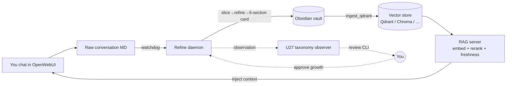
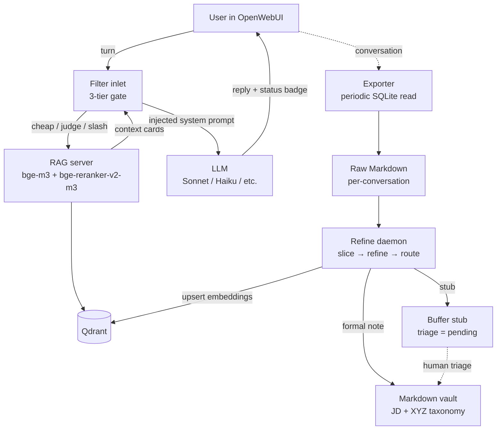

# throughline

> The thread that turns every LLM conversation into searchable, self-growing personal knowledge.

[](https://github.com/jprodcc-rodc/throughline/actions/workflows/test.yml)
[](https://github.com/jprodcc-rodc/throughline/releases/latest)
[](LICENSE)
[](https://www.python.org/)

**Status:** 🚧 Alpha — v0.2.0 shipped (`python install.py` wizard + import adapters + self-growing taxonomy). Reference implementation runs 24/7 for the author; external-user docs are being polished. See [`CHANGELOG.md`](CHANGELOG.md) for the version history.

---

## ✨ What it does



Three distinctive pieces you won't find glued together elsewhere:

1. **Haiku RecallJudge** — a single small-LLM call replaces mode/aggregate/topic-shift/query-rewrite detection. Badge shows the judge's verdict inline.
2. **Concept anchors** — self-growing whitelist of entities in your vault that short-query RAG gating uses to avoid embedding drift.
3. **Personal Context cards** — 4-layer stack (Filter valve → reranker boost → `<topic>__profile.md` auto-build → optional FastAPI agent) that injects your real profile into answers without contaminating the public RAG index.

### How is this different from `mem0` / `Letta` / `SuperMemory` / OpenWebUI built-in memory?

Short answer: **throughline produces durable, human-readable Markdown
that lives in your file system**. The others produce vectors that live
in their service. Different point on the privacy / portability /
durability axis.

| | throughline | mem0 | Letta | SuperMemory | OpenWebUI memory |
|---|---|---|---|---|---|
| **Storage** | Plain Markdown in your vault | Service-managed vectors | Server-managed agent state | Hosted SaaS | Sqlite blob in OpenWebUI |
| **Local-only path** | ✅ bge-m3 + Qdrant locally | partial | partial | ❌ | ✅ |
| **Read it without the tool** | ✅ any Markdown editor | ❌ | ❌ | ❌ | ❌ |
| **Self-growing taxonomy** | ✅ U27 review loop | ❌ | ❌ | ❌ | ❌ |
| **Plug-in vector store** | Qdrant / Chroma / + 4 v0.3 | one | none | none | sqlite-only |
| **Plug-in embedder** | bge-m3 / OpenAI / + aliases | OpenAI-only | OpenAI-only | hosted | one |
| **Cost-aware ingest** | ✅ daily USD cap (U3) | usage-based | usage-based | sub-based | n/a |
| **Audience** | Power users with a vault habit | App developers | Agent builders | Consumers | Casual chatters |

throughline is heavier to install (it's a daemon + RAG server + Filter,
not a SaaS subscription) but the cards persist across tool changes and
you can grep them with `rg` like any other text.

---

## 🃏 What a refined card looks like

You said this in chat:

> *I'm setting up PyTorch on an M2 MacBook Pro. Should I use mps or cpu? My model is a small transformer (~50M params).*

The daemon refines the conversation into a card like this:

```markdown
---
title: "PyTorch on Apple M2 — pick mps for small transformers"
date: 2026-04-01 09:21:00
knowledge_identity: universal
tags: [AI/LLM, y/Decision, z/Node]
source_conversation_id: "sample-001-mps-pytorch"
---

# Scene & Pain Point
A 50M-param transformer on M2 needs a device choice. CPU is the
safe default; MPS is faster but has rough edges that bite mid-training.

# Core Knowledge & First Principles
M2's unified memory architecture gives MPS roughly 4-6x speedup over
CPU for small transformers. Two adoption blockers: (1) some ops
silently fall back to CPU; (2) install path is non-default.

# Detailed Execution Plan
- `torch.device("mps")` in your model + tensors.
- `export PYTORCH_ENABLE_MPS_FALLBACK=1` so unsupported ops route to CPU
  instead of crashing.
- Install: `conda install pytorch torchvision torchaudio -c pytorch-nightly`.

# Pitfalls & Boundaries
- bitsandbytes 8-bit quantization is CUDA-only — pick CPU if you need it.
- Some attention variants and sparse tensor ops are not yet ported.
- Numerics differ slightly from CUDA; bad for benchmarking against a
  CUDA reference.

# Insights & Mental Models
MPS is a "default-on, opt-out" choice for small models on M-series
silicon: faster by default, with a known list of fallback hatches.

# Length Summary
Use `mps` for small transformers on M2; set the fallback env var;
install via conda nightly.
```

This is the file you'll commit to your vault, grep with `ripgrep`,
embed for RAG, and re-read in five years. The conversation it came
from is one line in a daemon log.

---

## 🚀 Quickstart

The fastest path is the install wizard: it asks 16 short questions
(every one has a sensible Enter-default), writes
`~/.throughline/config.toml`, and offers to bulk-import your existing
ChatGPT / Claude / Gemini export on the way through.

```bash
git clone https://github.com/jprodcc-rodc/throughline.git
cd throughline
python -m venv .venv && source .venv/bin/activate   # Windows: .venv\Scripts\activate
pip install -r requirements.txt
python install.py                                    # ← the 16-step wizard
```

What the wizard covers, in order: Python check → mission (Full /
RAG-only / Notes-only) → vector DB → API key → LLM provider → privacy
level → embedder + reranker → prompt family → import source + path →
import scan + cost estimate + **explicit privacy consent** → refine
tier (Skim / Normal / Deep) → card structure → live-LLM preview of
your first card with optional 5-dial tuning → taxonomy strategy →
daily USD cap → summary + run import.

After the wizard:

```bash
python rag_server/rag_server.py        # FastAPI on :8000 — embed + rerank + retrieval
python daemon/refine_daemon.py         # watchdog → refine → vault writer
```

Drop `filter/openwebui_filter.py` into OpenWebUI's Admin → Functions
panel; set its `RAG_SERVER_URL` valve to your local server. Now your
chats refine into cards, the cards get indexed, and the next chat
that overlaps gets the relevant cards injected.

> **Obsidian is optional.** The daemon writes plain Markdown +
> frontmatter; any editor reads it. Obsidian is recommended for the
> graph + linking UI, but nothing downstream requires it.

### Manual install (no wizard)

If the wizard is too opinionated for your setup, the long-form guide
in [`docs/DEPLOYMENT.md`](docs/DEPLOYMENT.md) walks the same five
steps by hand: configure `.env`, start Qdrant via Docker, launch the
RAG server + daemon, install the Filter.

### Pluggable backends (v0.2.0+)

Pick a backend at install time via the wizard, or flip later by
editing `config.toml` / setting env vars before launch:

| Component | Default | Alternates (today) | Coming in v0.3 |
|---|---|---|---|
| Embedder (`EMBEDDER`) | `bge-m3` (local) | `openai` | `nomic` / `minilm` natively |
| Reranker (`RERANKER`) | `bge-reranker-v2-m3` (local) | `cohere`, `skip` | `voyage` / `jina` natively |
| Vector store (`VECTOR_STORE`) | `qdrant` | `chroma` (optional dep) | `lancedb` / `duckdb_vss` / `sqlite_vec` / `pgvector` |

### LLM providers (16 preset routes)

Wizard step 4 picks the backend; step 5 picks a scoped model.
Every preset speaks the OpenAI-compatible `/v1/chat/completions`
shape, so switching providers is one env var, not a rewrite.
The wizard auto-detects whichever provider's env var you've
already exported and defaults to that — no preferred vendor.

| Region | Providers |
|---|---|
| **Direct (anywhere)** | OpenAI · Anthropic · DeepSeek · xAI |
| **Hosted open-weights** | Together.ai · Fireworks.ai · Groq |
| **China (大陆 access)** | SiliconFlow (硅基流动) · Moonshot (Kimi) · DashScope (Alibaba Qwen) · Zhipu (智谱 GLM) · Doubao (字节豆包) |
| **Multi-vendor proxy** | OpenRouter (one key → 300+ models) |
| **Local / self-hosted** | Ollama · LM Studio |
| **Escape hatch** | Generic OpenAI-compatible endpoint (`THROUGHLINE_LLM_URL` + `THROUGHLINE_LLM_API_KEY`) |

Each provider has its own env var (`OPENAI_API_KEY`,
`ANTHROPIC_API_KEY`, `SILICONFLOW_API_KEY`, `DEEPSEEK_API_KEY`,
`MOONSHOT_API_KEY`, `DASHSCOPE_API_KEY`, …). Existing users with
`OPENROUTER_API_KEY` already set keep working with zero config
change — the autodetect picks it up and routes accordingly.

Smoke test the install: ask something in OpenWebUI that overlaps your
existing notes. You should see an `⚡ anchor pass` or `auto recall:
mode=general · conf=0.82 · N cards` status line above the reply, an
injected context in the answer, and a `🛰️ daemon · …` outlet badge
when the daemon is running.

---

## 🏗️ Architecture



Two independent pipelines meet at Qdrant and the Markdown vault on disk. The Filter pipeline runs per-turn, in-band with the conversation, and never writes to the vault. The daemon pipeline runs out-of-band, produces knowledge cards from completed conversations, and never reads live chat sessions. Filter bugs cannot corrupt the vault; daemon bugs cannot pollute a live reply.

See [`docs/ARCHITECTURE.md`](docs/ARCHITECTURE.md) for the full story (three-tier recall gate, five integrity layers, Pack system, Echo Guard, Master-Event duality, 4-layer personal context, concept anchors, taxonomy, forward-slash normalisation, orthogonal mode triggering).

---

## 📁 Repository layout

```
throughline/
  filter/           OpenWebUI Filter Function (single-file paste into Admin → Functions)
  daemon/           Refine daemon (watches raw conversations, writes cards)
  rag_server/       FastAPI service: embedding, reranking, RAG endpoint, refine-status
  packs/            Pluggable domain packs (slicer/refiner/routing overrides; PTE example shipped)
  scripts/          One-off tooling: vault ingest, concept-anchor cold start, context sync
  prompts/en/       Verbatim mirror of the runtime prompt strings (review / translation surface)
  config/           .env.example, taxonomy template, forbidden_prefixes, launchd / systemd templates
  docs/             Architecture, deployment, design decisions, badge reference, strip log
  examples/         Small walkthrough fixtures
```

Each top-level directory has its own `README.md` for local detail.

---

## 💡 Why this exists

Most personal-knowledge tools either:
- **Record** but don't **synthesize** (raw transcripts pile up)
- **Synthesize** but lose **personal context** (generic answers about your own meds / projects / history)
- **Inject personal context** but leak it into the **public index** (your RAG now has your address in it)

This project separates *mechanism* (system provides) from *content* (you provide) at every layer, so you can safely share the engine without sharing yourself.

---

## 🔗 Links

- [Architecture](docs/ARCHITECTURE.md) — how the pieces fit
- [Deployment](docs/DEPLOYMENT.md) — end-to-end install
- [Design decisions](docs/DESIGN_DECISIONS.md) — why each call was made
- [Filter badge reference](docs/FILTER_BADGE_REFERENCE.md) — complete UI legend
- [Chinese-removal log](docs/CHINESE_STRIP_LOG.md) — what was stripped from the upstream private codebase and why (community re-i18n starts here)
- [Phase 6 regression checklist](docs/PHASE_6_CHECKLIST.md) — English-only test gates for pre-v0.1.0

---

## 🧪 Phase 6 regression (pre-v0.1.0)

The English rewrite has never been A/B'd against the original Chinese build. Phase 6 is the regression pass that validates the rewrite before tagging `v0.1.0`. Run `pytest fixtures/phase6/` for the offline gates or the individual `python fixtures/phase6/run_h*.py` scripts for live LLM gates.

| Gate | Scope | Status |
|---|---|---|
| **H1** RecallJudge classification drift | 48 EN turns × real Haiku 4.5 | **45/48 PASS (93.8%)** — 3 brainstorm-mode drift accepted as known EN-tone limitation |
| **H2** Cheap-gate short-turn routing | 20 EN turns offline | **10/20 MATCH + 10 documented gaps** — first-turn bare pronouns fall through to judge (accepted ~$0.003/turn cost) |
| **H3 code** Card injection wrapper + truncation | 9 offline assertions | **9/9 PASS** — card bodies always wrapped as DATA not INSTRUCTIONS |
| **H3 Haiku** Injection/PII/roleplay resistance | 31 EN turns × real Haiku 4.5 | **31/31 PASS (100%)** — zero compliance, zero leakage across 7 fingerprints |
| **H4** 4 refiner prompts (refine + route_domain) | 8 EN fixtures × real Sonnet 4.6 | **15/16 PASS (93.8%)** — 1 WARN on universal-vs-personal tension, zero structural failures |

Total phase-6 regression cost against live APIs: **~$0.44**. See [`fixtures/phase6/SESSION_STATE.md`](fixtures/phase6/SESSION_STATE.md) for the full run log and `H*_ANALYSIS.md` per-gate deep dives.

---

## 🤝 Contributing

PRs welcome once we hit `v0.1.0`. For now:
- Issues for bugs / design questions — yes
- Feature PRs — wait for v0.1.0 tag
- Docs / typo PRs — always yes

See [`CONTRIBUTING.md`](CONTRIBUTING.md).

---

## 📜 License

[MIT](LICENSE) — do what you want, no warranty.

---

## 🙏 Acknowledgments

Built on:
- [OpenWebUI](https://github.com/open-webui/open-webui) — the chat frontend
- [Qdrant](https://github.com/qdrant/qdrant) — default vector DB (Chroma / LanceDB / etc. swappable)
- [BAAI/bge-m3](https://huggingface.co/BAAI/bge-m3) + [bge-reranker-v2-m3](https://huggingface.co/BAAI/bge-reranker-v2-m3) — default local embeddings + reranking
- Any OpenAI-compatible LLM provider — [Anthropic](https://console.anthropic.com), [OpenAI](https://platform.openai.com), [DeepSeek](https://platform.deepseek.com), [Moonshot](https://platform.moonshot.cn), [SiliconFlow](https://siliconflow.cn), [OpenRouter](https://openrouter.ai), [Groq](https://console.groq.com), [Together](https://together.ai), [Ollama](https://ollama.com), or bring your own — see the full 16-preset table above
