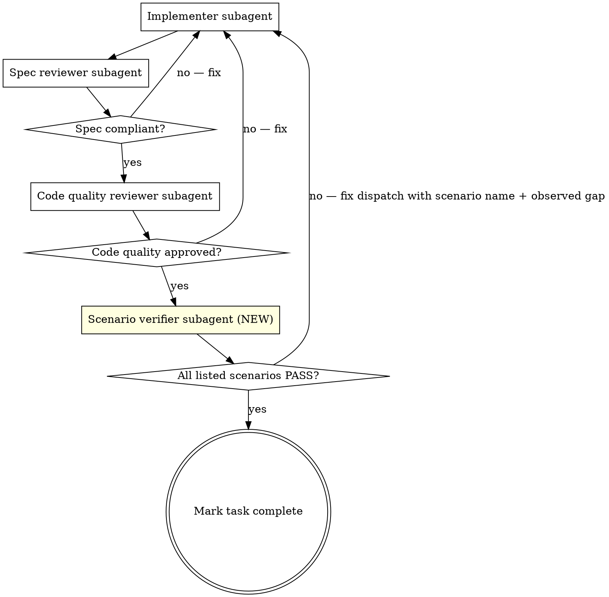

# Scenario Verification — Subagent Flow Extension

> **Status**: project-local extension to `superpowers:subagent-driven-development`. Active for any task in this repo.
> **Source of truth**: `docs/superpowers/specs/2026-05-01-rodix-product-test-scenarios.md` (v1.1+)
> **Owner**: CC maintains; Rodc spot-checks.

## Why this exists

Type checks and unit tests verify code correctness, not feature correctness. The two-stage review built into `subagent-driven-development` (spec compliance + code quality) catches code-vs-spec drift but not user-journey drift. This extension adds a third stage — **scenario verification** — that walks the relevant user journeys end-to-end after spec/code review pass.

Without this step, CC can claim a task done while the actual product experience is broken (the bug Rodc surfaced 2026-05-01: AI behaves like generic chatbot, onboarding leaves stale chat data, Card triggers on every chitchat reply).

## Extended per-task flow

The extended flow replaces the original `subagent-driven-development` per-task loop:

```
implementer → spec review → spec re-fix loop → code review → code re-fix loop
   → SCENARIO VERIFICATION (new) → scenario re-fix loop → mark complete
```

Concretely:



## Where scenarios live

Each per-feature plan in `docs/superpowers/plans/` has a `## References` section listing relevant scenario IDs:

```markdown
## References

- Scenarios: S-OB-1, S-OB-2, S-OB-3, S-MOBILE-1
- Roadmap v1.2 §...
```

The scenario IDs reference entries in `docs/superpowers/specs/2026-05-01-rodix-product-test-scenarios.md`.

If a plan has no scenarios listed (e.g., `#w-docs` — pure docs), the verification step is a no-op and the task can mark complete after code review.

## Scenario verifier subagent dispatch

Use `./scenario-reviewer-prompt.md` (this directory) as the prompt template. The verifier:

1. Reads the listed scenario IDs from the plan's `## References`.
2. Loads each scenario from the scenarios spec doc.
3. For each scenario, walks "应该看到 / 不应该看到" lines and reports per-line PASS / FAIL.
4. Returns a structured report: scenario ID + overall verdict (PASS / FAIL) + failed-line evidence.

## Failure handling

- **Any "应该看到" missing** OR **any "不应该看到" present** → scenario FAILS.
- A FAILED scenario = task NOT done. Dispatch a fix implementer with the scenario name + observed gap as the brief.
- After fix, re-run scenario verifier (not the full spec/code review chain unless the implementer's fix touched logic).
- If a scenario description itself looks wrong for the current implementation (Failure mode F-2 in scenarios spec): **do not change code to fit the scenario**. Surface the mismatch to Rodc + Opus, propose a scenario edit, wait for sign-off.

## What CC cannot skip

- Cannot skip scenario verification because "code review passed".
- Cannot mark task complete with even one failing line.
- Cannot fix scenario text to match buggy code.
- Cannot dispatch scenario verification before spec + code review both pass (verifier should not waste time on broken builds).

## Wave-level spot check

When a wave is claimed done, Rodc walks 3-5 random scenarios at desktop + iPad. Spot-check failure → wave is NOT done; fix dispatch + re-verify the broken scenarios.

CC's job: make spot-check FAIL rate ≈ 0 by running scenarios honestly per task.

## When CC adds new scenarios

While implementing, CC may discover user journeys the spec doesn't cover. Add a new scenario to `docs/superpowers/specs/2026-05-01-rodix-product-test-scenarios.md` with:

- Naming convention from §"Naming convention" in the spec
- Setup / 操作 / 应该看到 / 不应该看到 sections
- Commit message: `docs: add scenario S-XXX-N for <feature>`

Rodc reviews new scenarios at end of wave, not per-add.
